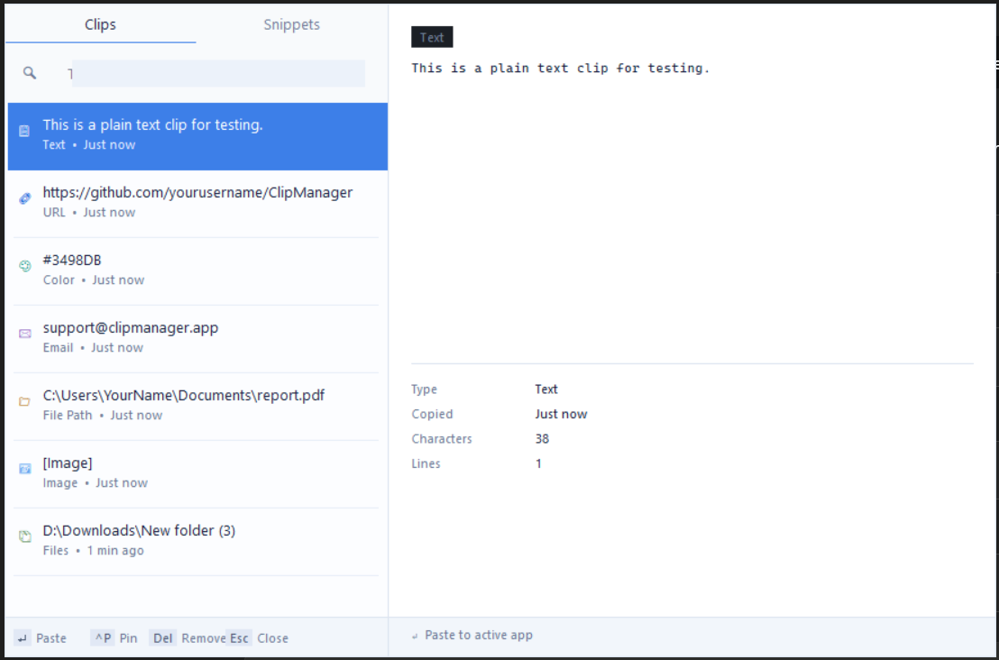

# ClipManager

A fast, native Windows clipboard history manager built in C++/Win32. No Electron, no .NET runtime — just a lightweight tray app.
ClipManager runs silently in your system tray, monitors clipboard changes using modern Windows APIs, and provides a quick-access popup window at your cursor position to search and paste your clipboard history.



## Features

- **Clipboard history** — automatically tracks everything you copy, including images
- **Smart detection** — auto-tags URLs, hex colors, file paths, and emails with quick actions (open in browser, open in Explorer, copy hex)
- **Image support** — captures screenshots and copied images with thumbnail previews
- **Global hotkey** — `Win+V` opens a searchable popup near your cursor
- **Pin favorites** — keep important clips at the top forever
- **Privacy controls** — exclude password managers, pause monitoring, auto-clear on exit
- **Auto-delete** — clean up clips older than N days
- **System tray** — runs quietly in the background, starts with Windows

## Install

Download the latest `ClipManager_Setup.exe` from [Releases](../../releases) and run it. The installer adds a Start Menu entry, desktop shortcut, and registers ClipManager to launch at login.

## Build from source

Requirements: Visual Studio 2022+ (Desktop C++ workload), CMake 3.20+

```powershell
cmake -B build -G "Visual Studio 17 2022" -A x64
cmake --build build --config Release
```

Binary will be at `build\Release\ClipManager.exe`.

## Usage

| Action | Shortcut |
|---|---|
| Open clipboard history | `Ctrl + Shift + V` |
| Paste selected clip | `Enter` |
| Pin / unpin clip | `Ctrl + P` |
| Remove clip | `Ctrl + Del` |
| Close popup | `Esc` |

Right-click the tray icon for Settings, manual history view, or to exit.

## Architecture
src/
├── main.cpp        — WinMain, message loop, clipboard orchestration
├── clipboard.cpp    — AddClipboardFormatListener wrapper, read/write
├── popup.cpp        — Two-panel search UI (list + preview), owner-drawn
├── tray.cpp         — Shell_NotifyIcon wrapper, context menu
├── settings.cpp     — Tabbed settings dialog
├── storage.cpp      — Plain-text history persistence
├── detector.cpp     — Regex-based content type detection
└── imaging.cpp      — GDI+ image capture/thumbnail/cleanup

Uses `AddClipboardFormatListener` (Vista+) rather than the legacy `SetClipboardViewer` chain, avoiding the classic "one app crashes, clipboard breaks for everyone" bug.

## License

MIT