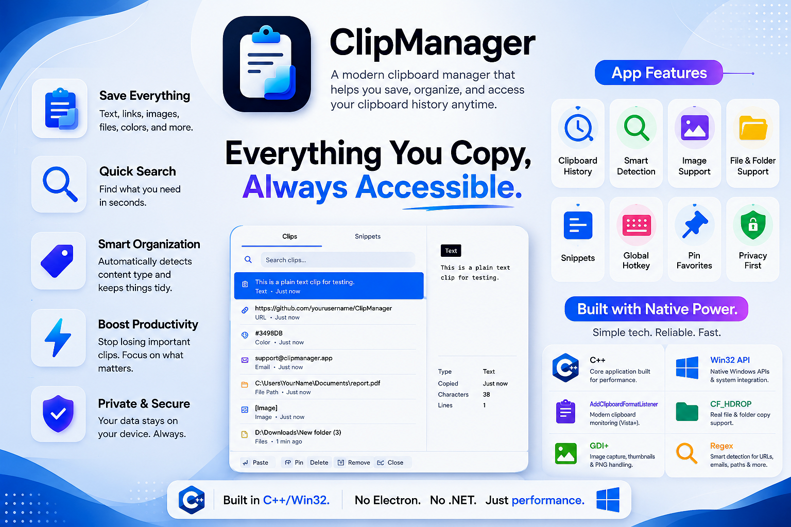

# ClipManager

A fast, native Windows clipboard manager built in C++/Win32. No Electron, no .NET runtime — just a lightweight tray app.



## Features

- **Clipboard history** — automatically tracks everything you copy: text, images, files/folders
- **Smart detection** — auto-tags URLs, hex colors, file paths, and emails with one-click quick actions (open in browser, open in Explorer, copy hex)
- **Image support** — captures screenshots and copied images with thumbnail previews, auto-cleans orphaned files
- **File & folder support** — copy files in Explorer, paste the real file back later — not just the path
- **Snippets** — save reusable text (signatures, commands, templates) in a dedicated tab, separate from clipboard history
- **Global hotkey** — `Ctrl+Shift+V` opens a searchable two-panel popup near your cursor
- **Pin favorites** — keep important clips at the top forever
- **Privacy controls** — exclude password managers, pause monitoring, clear on exit
- **Auto-delete** — clean up clips older than N days
- **First-run wizard** — quick 3-step setup on first launch
- **System tray** — runs quietly in the background, starts with Windows

## Install

Download the latest `ClipManager_Setup.exe` from [Releases](../../releases) and run it. The installer adds a Start Menu entry, desktop shortcut, and registers ClipManager to launch at login.

## Build from source

Requirements: Visual Studio 2022+ (Desktop C++ workload), CMake 3.20+

```powershell
cmake -B build -G "Visual Studio 17 2022" -A x64
cmake --build build --config Release
```

Binary will be at `build\Release\ClipManager.exe`.

## Usage

| Action | Shortcut |
|---|---|
| Open clipboard history | `Ctrl + Shift + V` |
| Paste selected clip | `Enter` |
| Pin / unpin clip | `Ctrl + P` |
| Remove clip | `Ctrl + Del` |
| Add New Snippet | `Ctrl + N` |
| Close popup | `Esc` |

Right-click the tray icon for Settings, manual history view, or to exit.

## 🏗️ Architectural Overview

Unlike older clipboard utilities that rely on fragile hooks or the outdated `SetClipboardViewer` chain, ClipManager is built from the ground up to be safe, event-driven, and highly performant.

### Core Architecture Components

* **Application Core (`src/core/`)**: Handles the app lifecycle, single-instance execution via a system Mutex, and a global-state-free Win32 message loop utilizing GWLP_USERDATA routing.
* **Clipboard Monitor (`src/components/clipboard.cpp`)**: Implements the modern AddClipboardFormatListener API for crash-resilient, system-friendly tracking of WM_CLIPBOARDUPDATE messages.
* **UI System (`src/ui/`)**: Manages double-buffered window painting, custom tray notification icons, and advanced cursor-tracked popups optimized via WM_ACTIVATE to prevent focus-stealing.
* **Async Storage & GDI+ Imaging (`src/components/storage.cpp`, `src/components/imaging.cpp`)**: Offloads intensive disk write operations and GDI+ screenshot/thumbnail parsing to a background worker thread to prevent interface micro-stutters.

### Project File Structure

```text
ClipManager/
├── CMakeLists.txt              # Core build configuration
├── README.md                   # Project documentation
├── .gitignore                  # Build and IDE exclusions
├── installer/
│   └── installer.nsi           # NSIS deployment installer script
├── resources/
│   ├── icon.ico                # Application tray & window icon
│   └── resource.rc             # Windows resource file (version info + icon)
└── src/
    ├── common.h                # Shared definitions, macros, structural contracts
    ├── main.cpp                # App entry point & message dispatching
    ├── clipboard.h / .cpp      # Advanced clipboard monitoring & format extraction
    ├── tray.h / .cpp           # Shell_NotifyIcon & tray context menu implementation
    ├── popup.h / .cpp          # Owner-drawn 2-panel interface, rendering loops & WndProc
    ├── settings.h / .cpp       # 5-tab configuration panel layout & state tracking
    ├── storage.h / .cpp        # Backward-compatible pipe-delimited database engine
    ├── detector.h / .cpp       # Regex smart-content classification engine
    ├── imaging.h / .cpp        # GDI+ snapshot capture, thumbnail generation & orphan cleanup
    ├── snippets.h / .cpp       # Dynamic snippet repository and string expansion mapping
    └── wizard.h / .cpp         # First-run PerMonitorV2 DPI-aware setup wizard
```

Uses `AddClipboardFormatListener` (Vista+) rather than the legacy `SetClipboardViewer` chain, avoiding the classic "one app crashes, clipboard breaks for everyone" bug.

File/folder clips use `CF_HDROP` so pasted items are real files, not just text paths. Images are stored as PNGs in `%APPDATA%\ClipManager\images\`, with automatic orphan cleanup on startup and whenever history is trimmed or cleared.

## Data storage

- History: `%APPDATA%\ClipManager\history.txt`
- Snippets: `%APPDATA%\ClipManager\snippets.txt`
- Images: `%APPDATA%\ClipManager\images\`

Uninstalling removes all of the above.

## License

MIT